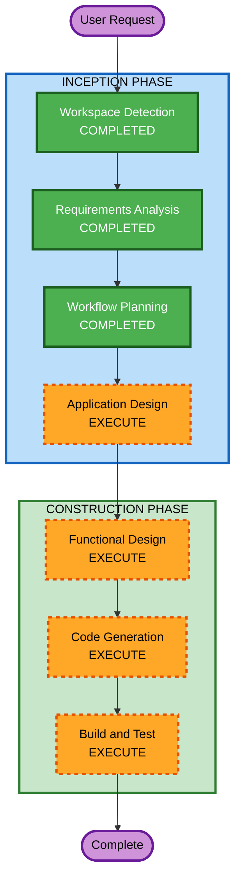

# Execution Plan — AIDLC演示产品

## Detailed Analysis Summary

### Change Impact Assessment
- **User-facing changes**: Yes — 全新演示网站
- **Structural changes**: Yes — 全新前端架构
- **Data model changes**: No — 纯前端，无数据库
- **API changes**: No — 无后端服务
- **NFR impact**: Low — 本地运行，纯展示

### Risk Assessment
- **Risk Level**: Low（纯前端展示项目，无外部依赖）
- **Rollback Complexity**: Easy（本地开发）
- **Testing Complexity**: Simple（浏览器直接验证）

## Workflow Visualization

## Phases to Execute

### INCEPTION PHASE
- [x] Workspace Detection (COMPLETED)
- [x] Requirements Analysis (COMPLETED)
- [x] Workflow Planning (COMPLETED)
- [ ] User Stories - SKIP
  - **Rationale**: 纯展示型应用，无用户角色交互，需求已充分覆盖
- [ ] Application Design - EXECUTE
  - **Rationale**: 需要定义组件结构和幻灯片系统架构
- [ ] Units Generation - SKIP
  - **Rationale**: 单体前端应用

### CONSTRUCTION PHASE
- [ ] Functional Design - EXECUTE
  - **Rationale**: 需要定义幻灯片内容结构和交互逻辑
- [ ] NFR Requirements - SKIP
  - **Rationale**: 纯展示应用，无特殊NFR需求
- [ ] NFR Design - SKIP
- [ ] Infrastructure Design - SKIP
  - **Rationale**: 本地开发，无部署需求
- [ ] Code Generation - EXECUTE (ALWAYS)
- [ ] Build and Test - EXECUTE (ALWAYS)

## Estimated Timeline
- **Total Stages to Execute**: 4 (Application Design + Functional Design + Code Generation + Build and Test)
- **Estimated Duration**: 1-3天

## Success Criteria
- **Primary Goal**: 可运行的PPT风格React演示网站
- **Key Deliverables**:
  - 15-20页幻灯片内容
  - 键盘/按钮导航系统
  - 交互式代码演示区域
  - 数据可视化图表
  - 流畅的切换动画
